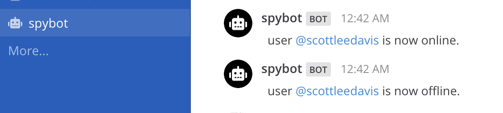

# Mattermost Plugin Spybot  [](https://circleci.com/gh/scottleedavis/mattermost-plugin-spybot)

Inspired by the [mattermost-spybot](https://github.com/prabhu43/mattermost-spybot) integration.

Has the slash commands `/spy @username`, `/unspy @username` and `/spy list`

You get a notification when the person is online, offline, or 'do not disturb'.  (away is ignored)




### Installation

_requires Mattermost 5.10 or greater_

1) Go to the [releases page](https://github.com/scottleedavis/mattermost-plugin-spybot/releases) of this GitHub repository and download the latest release for your Mattermost server.
2) Upload this file in the Mattermost System Console > Plugins > Management page to install the plugin. To learn more about how to upload a plugin, see the documentation.
    
### Building
```
make
```

This will produce a single plugin file (with support for multiple architectures) for upload to your Mattermost server:

```
dist/com.github.scottleedavis.mattermost-plugin-spybot.tar.gz
```
